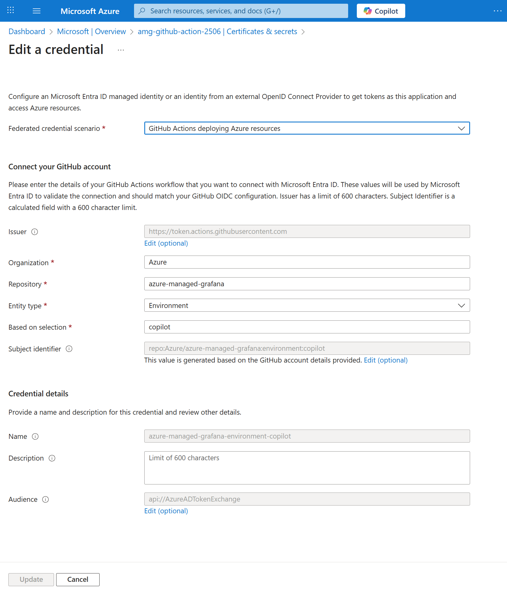

# Setup AMG-MCP in GitHub Copilot
### Step 1: Setup Entra Id app
From Azure portal, we need to create an Entra Id application that the Copilot coding agent will use to access Azure stuffs.
Add a "Federated credential" to the Entra Id app to allow access from the GitHub repo.


### Step 2: copilot-setup-steps.yml
Add a new file with path [.github/workflows/copilot-setup-steps.yml](.github/workflows/copilot-setup-steps.yml). There are two things to call out:
1. The MCP server binary is downloaded.
2. azure cli login is needed for MCP server to have access

### Step 3: configure GitHub Copilot agent to use the MCP
Add AMG-MCP in MCP configuration. `Settings` -> `Copilot` -> `Coding agent` -> `MCP configuration`
The content can be found in [github-mcp.json](./github-mcp.json).

#### AMG-MCP Configuration

##### Command
Path to the MCP binary:
```
/home/runner/work/azure-managed-grafana/azure-managed-grafana/bin/amg-mcp
```

> **Note:** Ensure the MCP binary path corresponds to the downloaded path in `copilot-setup-steps.yml`.

##### Arguments
The following arguments configure various Azure services for AMG-MCP:

**Azure Managed Grafana Endpoint:**
```
--AmgMcpOptions:AzureManagedGrafanaEndpoint=https://github-demo-2508-wus2-ggdyf2etcaf3bda3.wus2.grafana.azure.com
```
- This is the endpoint for the Azure Managed Grafana instance
- Can be found in the Azure portal under the Grafana resource

### Step 4: Configure GitHub Copilot Agent Firewall Rules
Add AMG-MCP in MCP configuration: `Settings` → `Copilot` → `Coding agent` → `Custom allowlist`

Add the following domains to the allowlist:
```
management.azure.com
login.microsoftonline.com
westus2-2.in.applicationinsights.azure.com
grafana.azure.com
vault.azure.net
kusto.windows.net
```

These domains are required for AMG-MCP to access various Azure services and authenticate properly.
