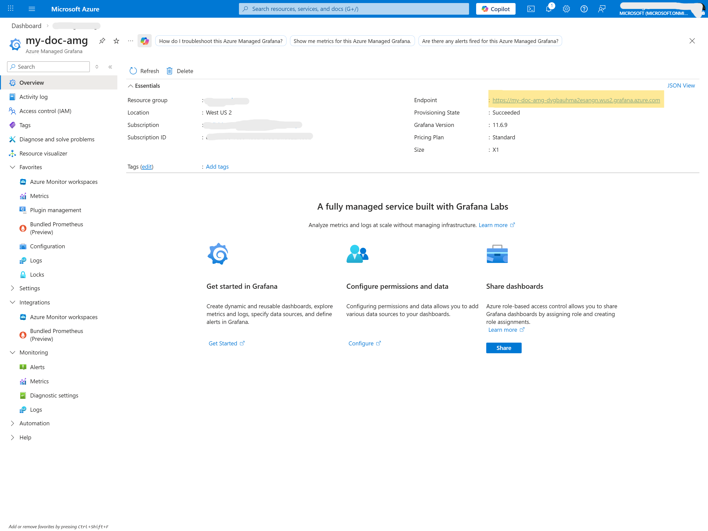
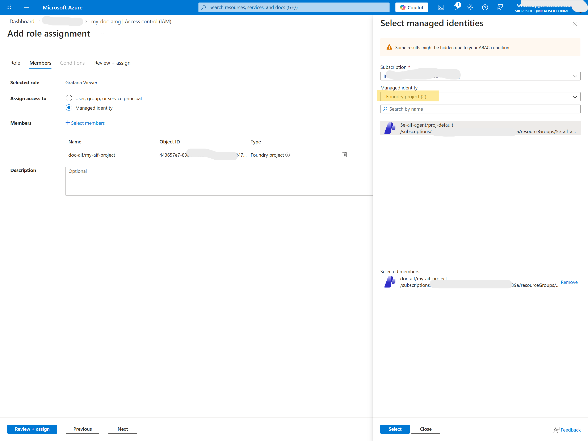
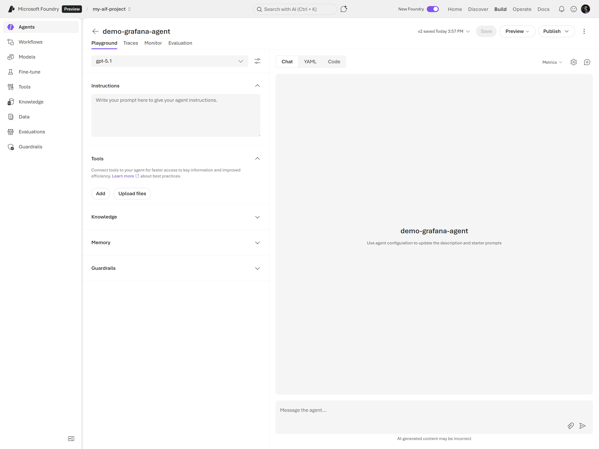
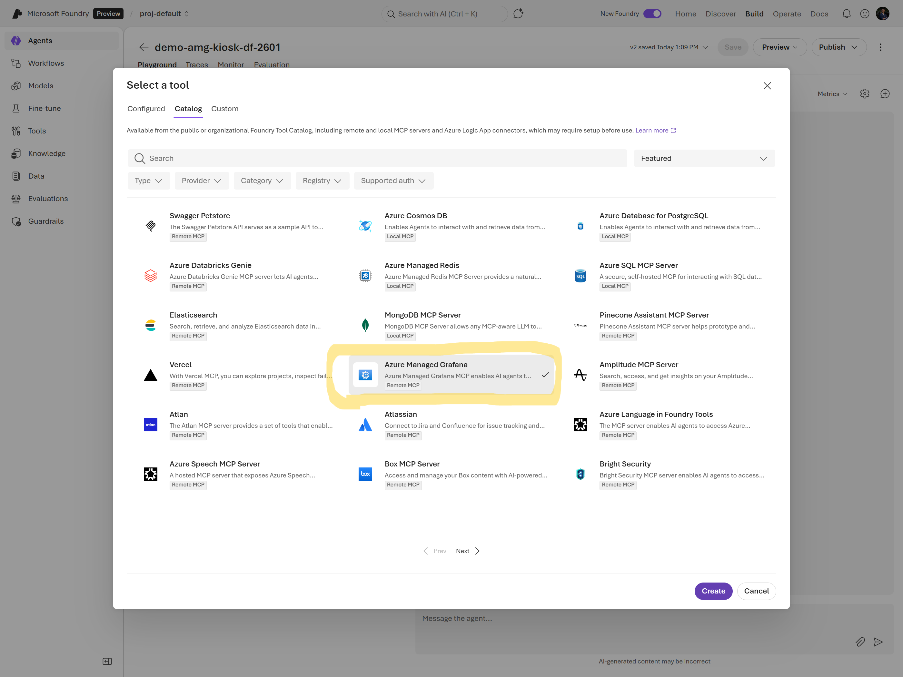
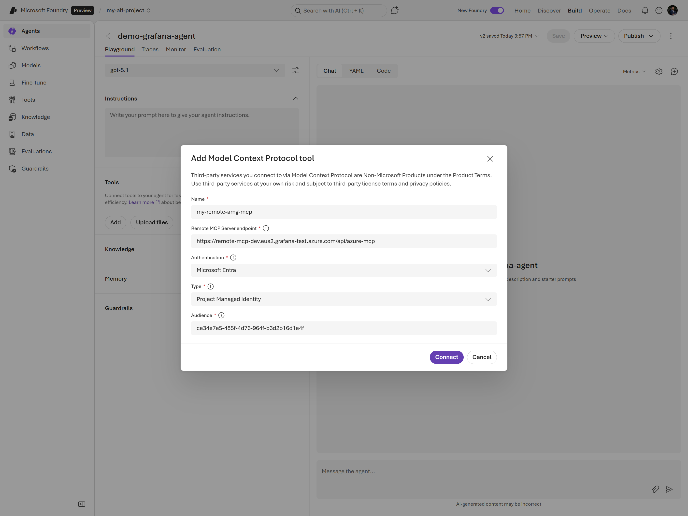
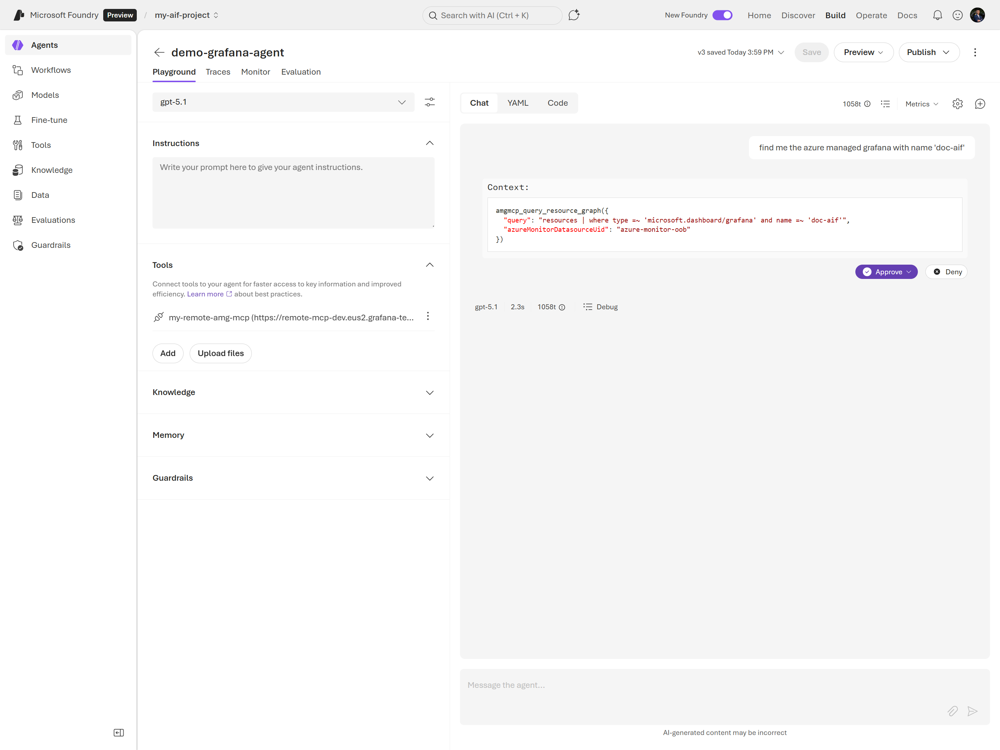

# Using AMG-MCP in Foundry Agent
This sample will walk you through the steps to configure and use the Azure Managed Grafana in a Foundry agent.

Prerequisites:
- An Azure account with permissions to create resources.
- An Azure Managed Grafana instance set up in your Azure account.
- AI Foundry environment where you can deploy agents.

## Step 1: Set Up Azure Managed Grafana
In the Azure portal, create a new Azure Managed Grafana instance if you haven't already. In the resource overview, find out the endpoint URL for your Grafana instance, as you will need it later. e.g. `https://my-doc-amg-dvgbauhma2esangn.wus2.grafana.azure.com`

## Step 2: Grant Access to Foundry
In the Grafana's `Access Control (IAM)` settings, add the necessary permissions for your Foundry environment to access the Grafana instance. e.g. You can grant `Grafana Admin` role to the managed identity used by your Foundry project.

## Step 3: Create Foundry Agent
You can create a new Foundry agent with a model that supports tools.

## Step 4: Add AMG-MCP Tool to the Agent
You can create a new tool in the 'Tools' section of your Foundry agent configuration. Then choose `Custom` and select `Model Context Protocol (MCP)` as the tool type.

Choose `Microsoft Entra` as the Authentication.
Use `ce34e7e5-485f-4d76-964f-b3d2b16d1e4f` for Audience.

## Step 5: Test the Agent
Once the MCP tool is configured, you can test the agent by triggering a resource graph query. Like a sample prompt 'list azure managed Grafana'.

