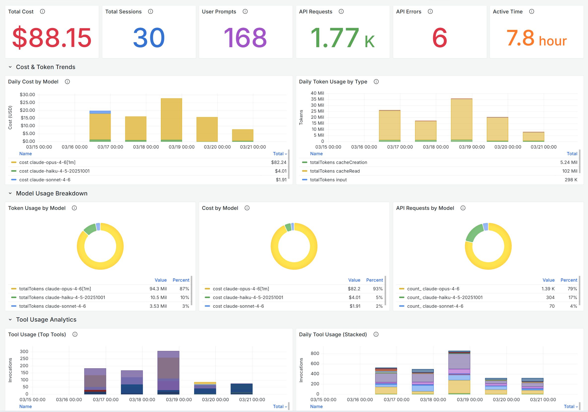
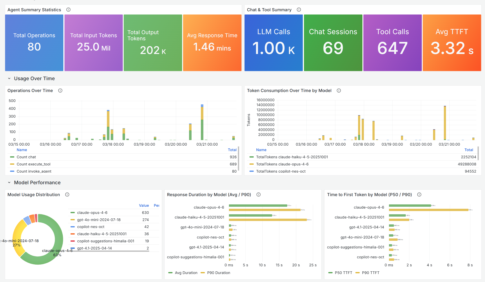
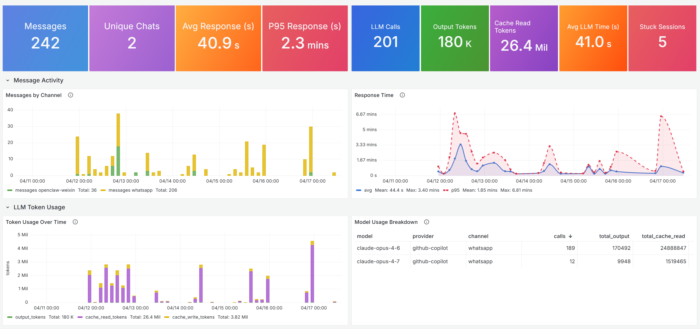

# Monitoring AI Coding Agents with Grafana

AI coding agents — GitHub Copilot, Claude Code, Codex, OpenClaw, and others — are quickly becoming part of how engineering teams ship software. Adoption is the easy part. The harder questions follow soon after:

- **How much are we spending?** Which models, which teams, which tasks drive the cost?
- **Who is actually using which agent, and for what?** Are tools being invoked the way we expect?
- **Is the experience reliable?** Where do agents stall, error out, or leave sessions stuck?
- **Can we audit what the agents did?** Prompts, tool calls, model choices — for security and compliance review.

Grafana gives you a single pane of glass for these questions across multiple coding agents. This guide shows how to set it up end-to-end: standing up the telemetry pipeline, pointing each agent at it, and importing the ready-made dashboards.

> **Support boundaries.** The OpenTelemetry Collector (including the `contrib` distribution) and the [Azure Monitor Exporter](https://github.com/open-telemetry/opentelemetry-collector-contrib/tree/main/exporter/azuremonitorexporter) are open-source components. Support for these components is provided exclusively through community channels. To submit bug reports, request new features, or report other issues, create a new issue in the [opentelemetry-collector-contrib](https://github.com/open-telemetry/opentelemetry-collector-contrib/issues) repository. Microsoft Azure Support covers the Azure services in this pipeline: Application Insights, Log Analytics, and Grafana.

## What you'll see

Three purpose-built Grafana dashboards visualize the signals that matter for AI coding agents — cost, token consumption, sessions, model usage, tool invocations, latency, and errors:

| Dashboard | What it shows | Link |
| --- | --- | --- |
| [GitHub Copilot](https://aka.ms/amg/dash/gh-copilot) | Operations, input/output tokens, chat sessions, tool calls, response time and TTFT by model | `aka.ms/amg/dash/gh-copilot` |
| [Claude Code](https://aka.ms/amg/dash/claude-code) | Cost, sessions, user prompts, API requests/errors, daily cost and token trends, per-model breakdown, tool usage analytics | `aka.ms/amg/dash/claude-code` |
| [OpenClaw](https://aka.ms/amg/dash/openclaw) | Messages, unique chats, response time, LLM calls, token usage, cache reads, stuck sessions, model usage breakdown | `aka.ms/amg/dash/openclaw` |



## Who this is for

The same dashboards serve different audiences:

- **Platform and DevEx teams** — track adoption trends, spend by team and model, and surface inefficient usage patterns.
- **Engineering leaders** — correlate agent activity with delivery and answer "is this investment paying off?"
- **Security and governance teams** — review prompts, tool invocations, and model choices for compliance and risk.
- **Individual developers and oncall engineers** — debug agent behavior, slow tool calls, or stuck sessions.

## How it works

```
┌───────────────┐    OTLP/HTTP    ┌──────────────────┐    Azure Monitor    ┌──────────────────┐              ┌──────────┐
│  AI coding    │ ──────────────> │  OTel Collector  │ ────── Exporter ──> │    Application   │ <─── KQL ─── │ Grafana  │
│    agent      │                 │                  │                     │     Insights     │              │ dashboard│
└───────────────┘                 └──────────────────┘                     └──────────────────┘              └──────────┘
```

- Each **AI coding agent** (GitHub Copilot / Claude Code / Codex / OpenClaw) emits OpenTelemetry traces, metrics, and logs to a configured OTLP endpoint.
- An **OpenTelemetry Collector** terminates OTLP at that endpoint and forwards the data to Application Insights using the Azure Monitor Exporter.
- **Grafana** queries Application Insights via the Azure Monitor data source (Log Analytics / KQL) to render the dashboards.

The OTLP collector and Application Insights pipeline are infrastructure — a one-time setup. The rest of this guide walks through it.

## Prerequisites

- An Application Insights resource. If you don't have one yet, [create one and attach it to a Log Analytics workspace](https://learn.microsoft.com/en-us/azure/azure-monitor/app/create-workspace-resource).
- [Docker installed.](https://docs.docker.com/engine/install/)
- A Grafana instance with an Azure Monitor data source that can read your Application Insights resource. [Grafana 11.6+ is required](https://learn.microsoft.com/en-us/azure/managed-grafana/) for these dashboards.

## Step 1. Run the OpenTelemetry Collector

Deploy an [OpenTelemetry Collector](https://opentelemetry.io/docs/collector/) (the `contrib` distribution) configured with the [Azure Monitor Exporter](https://github.com/open-telemetry/opentelemetry-collector-contrib/tree/main/exporter/azuremonitorexporter). The collector bridges OTLP from each agent to the Application Insights ingestion API.

> **Alternative — native OTLP ingestion in Azure Monitor (Preview).** Azure Monitor also supports native OTLP ingestion as an alternative to the path shown in this guide. The dashboards work with either path because data lands in the same Application Insights / Log Analytics tables. See [Ingest OTLP data into Azure Monitor with the OpenTelemetry Collector (Preview)](https://learn.microsoft.com/en-us/azure/azure-monitor/containers/opentelemetry-protocol-ingestion).

### Get the Application Insights connection string

The collector needs an Application Insights **connection string** to export telemetry. To retrieve it from the Azure Portal:

1. Sign in to the [Azure Portal](https://portal.azure.com/).
2. Navigate to your **Application Insights** resource.
3. In the left menu, select **Overview**.
4. Locate the **Connection String** field in the Essentials panel and select the copy icon next to it.

The value looks like:

```
InstrumentationKey=00000000-0000-0000-0000-000000000000;IngestionEndpoint=https://<region>.in.applicationinsights.azure.com/;LiveEndpoint=https://<region>.livediagnostics.monitor.azure.com/;ApplicationId=00000000-0000-0000-0000-000000000000
```

Paste it into the collector config below as the `azuremonitor.connection_string` value. Treat the connection string as a secret — anyone with it can send data to your Application Insights resource.

### Sample collector config

```yaml
receivers:
  otlp:
    protocols:
      http:
        endpoint: 0.0.0.0:4318
      grpc:
        endpoint: 0.0.0.0:4317

exporters:
  azuremonitor:
    connection_string: "InstrumentationKey=<YOUR-KEY>;IngestionEndpoint=https://<region>.in.applicationinsights.azure.com/;LiveEndpoint=https://<region>.livediagnostics.monitor.azure.com/"

service:
  pipelines:
    traces:
      receivers: [otlp]
      exporters: [azuremonitor]
    metrics:
      receivers: [otlp]
      exporters: [azuremonitor]
    logs:
      receivers: [otlp]
      exporters: [azuremonitor]
```

### Run with Docker

Save the config above as `otel-collector-config.yaml`, then start the collector with the `contrib` image (which includes the Azure Monitor exporter):

```bash
docker run -d --name otel-collector -p 4318:4318 -p 4317:4317 -v $(pwd)/otel-collector-config.yaml:/etc/otelcol-contrib/config.yaml otel/opentelemetry-collector-contrib:latest
```

Notes:
- The examples below assume the collector is running locally, reachable at `http://localhost:4318`. For a shared/remote collector, substitute your own endpoint.
- The OTLP/HTTP receiver listens on port `4318` by default; all three agents documented here use OTLP/HTTP.

## Step 2. Point each AI coding agent at the collector

Each agent has its own way to enable OpenTelemetry export. The shared target is the collector's OTLP/HTTP endpoint.

### GitHub Copilot



GitHub Copilot emits OpenTelemetry signals when configured through VS Code settings. See the [official docs](https://code.visualstudio.com/docs/copilot/guides/monitoring-agents).

Add to VS Code `settings.json`:

```json
{
    "github.copilot.chat.otel.enabled": true,
    "github.copilot.chat.otel.exporterType": "otlp-http",
    "github.copilot.chat.otel.otlpEndpoint": "http://localhost:4318",
    "github.copilot.chat.otel.captureContent": true
}
```

The Copilot dashboard surfaces total operations, input/output tokens, chat sessions, tool calls, and per-model latency (average duration, P50/P90 TTFT) — useful for spotting model-mix drift and slow tools.

### Claude Code


Claude Code reads telemetry configuration from environment variables. See the [official docs](https://code.claude.com/docs/en/monitoring-usage).

Add to the Claude Code `settings.json`:

```json
{
  "env": {
    "CLAUDE_CODE_ENABLE_TELEMETRY": "1",
    "OTEL_METRICS_EXPORTER": "otlp",
    "OTEL_LOGS_EXPORTER": "otlp",
    "OTEL_EXPORTER_OTLP_PROTOCOL": "http/protobuf",
    "OTEL_EXPORTER_OTLP_ENDPOINT": "http://localhost:4318",
    "OTEL_LOG_USER_PROMPTS": "1",
    "OTEL_LOG_TOOL_DETAILS": "1",
    "OTEL_METRICS_INCLUDE_VERSION": "true"
  }
}
```

Tip: `OTEL_LOG_USER_PROMPTS` and `OTEL_LOG_TOOL_DETAILS` enrich the dashboard's per-user and tool-usage panels. Omit them if you prefer not to capture prompt text — for example, in regulated environments where prompts may contain sensitive content.

The Claude Code dashboard breaks down daily cost and token usage by model, shows API errors, and ranks the most-invoked tools — useful for managing spend and catching tool-call regressions.

### Codex

Codex emits OpenTelemetry signals when configured through the global Codex `config.toml`. Codex Desktop/App Server currently relies on the user-level config for global onboarding, so configure `~/.codex/config.toml` rather than a project-scoped `.codex/config.toml`. On Windows, the default path is `C:\Users\<user>\.codex\config.toml`.

Add to the global Codex `config.toml`:

```toml
[otel]
environment = "devbox"
log_user_prompt = true
exporter = { otlp-http = { endpoint = "http://localhost:4318/v1/logs", protocol = "binary" } }
trace_exporter = { otlp-http = { endpoint = "http://localhost:4318/v1/traces", protocol = "binary" } }
metrics_exporter = { otlp-http = { endpoint = "http://localhost:4318/v1/metrics", protocol = "binary" } }
```

Restart Codex after saving the file so the Codex app server or CLI process reloads the global configuration.

Tip: `log_user_prompt = true` emits the most complete data, including raw user prompts. Set it to `false` if prompts may contain sensitive content or if your organization does not permit prompt capture.

Codex telemetry includes agent activity such as model/API calls, tool invocations, prompt-related events when enabled, token usage, latency, errors, and session context. This is useful for auditing agent behavior, understanding tool usage, and tracking cost and reliability across Codex sessions.

### OpenClaw



OpenClaw gateway publishes OpenTelemetry signals via its logging/telemetry config. See the [official docs](https://docs.openclaw.ai/logging#export-to-opentelemetry).

Add to the gateway's telemetry config:

```json
{
  "enabled": true,
  "endpoint": "http://localhost:4318",
  "protocol": "http/protobuf",
  "serviceName": "openclaw-gateway",
  "traces": true,
  "metrics": true,
  "logs": true,
  "sampleRate": 1,
  "flushIntervalMs": 5000
}
```

Important: `serviceName` must be `openclaw-gateway`. The OpenClaw dashboard filters by `cloud_RoleName == "openclaw-gateway"`, which is derived from this field.

The OpenClaw dashboard tracks messages by channel, response-time percentiles, cache-read tokens, and stuck sessions — useful for chat-style deployments where session health and cache efficiency drive both cost and user experience.

## Step 3. Verify data is reaching Application Insights

Once the agents and the collector are running, confirm telemetry is arriving before importing the dashboards:

1. Azure Portal → your Application Insights resource → **Logs**
2. Run a KQL check for each source:

```kusto
// GitHub Copilot
dependencies
| where timestamp > ago(1h)
| where cloud_RoleName == "copilot-chat"
| take 50
```

```kusto
// Claude Code
customMetrics
| where timestamp > ago(1h)
| where name startswith "claude_code"
| take 50
```

```kusto
// Codex
union isfuzzy=true traces, customEvents, dependencies, customMetrics
| where timestamp > ago(1h)
| where cloud_RoleName contains "codex"
   or tostring(customDimensions["service.name"]) contains "codex"
   or name contains "codex"
   or message contains "codex"
| take 50
```

```kusto
// OpenClaw
dependencies
| where timestamp > ago(1h)
| where cloud_RoleName == "openclaw-gateway"
| take 50
```

If rows come back, the pipeline is working. If not, check the collector logs for export errors — typical culprits are a wrong connection string, blocked egress to the Application Insights ingestion endpoint, or a firewalled OTLP receiver port.

## Step 4. Import the dashboards into Grafana or access them in Azure portal

Each dashboard has its own import and variables reference:

- [GitHub Copilot](https://aka.ms/amg/dash/gh-copilot)
- [Claude Code](https://aka.ms/amg/dash/claude-code)
- [OpenClaw](https://aka.ms/amg/dash/openclaw)

All three require **Grafana 11.6+** with an **Azure Monitor data source** that has access to the subscription containing your Application Insights resource.

> **Tip — same dashboards in the Azure Portal.** These dashboards are also available natively in the Azure Portal as Azure Monitor dashboards with Grafana (Helios), with no separate Grafana instance required. See [Use Azure Monitor dashboards with Grafana](https://learn.microsoft.com/en-us/azure/azure-monitor/visualize/visualize-use-grafana-dashboards).

## Where to go from here

- **Add more agents.** The same collector handles any OTLP-emitting tool. As your team adopts new coding agents, point them at the same endpoint and contribute or build a dashboard.
- **Set alerts.** Use Application Insights alert rules or Grafana alerting against the same data — for example, on daily cost above a threshold, sustained API error rate, or stuck-session count.
- **Share with stakeholders.** Pin the dashboards to a Grafana playlist or embed selected panels in your team's status pages so adoption, cost, and reliability stay visible to leadership.

## References

- [OpenTelemetry Collector](https://opentelemetry.io/docs/collector/)
- [Azure Monitor Exporter for the OpenTelemetry Collector](https://github.com/open-telemetry/opentelemetry-collector-contrib/tree/main/exporter/azuremonitorexporter)
- [Ingest OTLP data into Azure Monitor with the OpenTelemetry Collector (Preview)](https://learn.microsoft.com/en-us/azure/azure-monitor/containers/opentelemetry-protocol-ingestion)
- [Use Azure Monitor dashboards with Grafana](https://learn.microsoft.com/en-us/azure/azure-monitor/visualize/visualize-use-grafana-dashboards)
- [Application Insights connection strings](https://learn.microsoft.com/en-us/azure/azure-monitor/app/sdk-connection-string)
- [Monitoring GitHub Copilot agents](https://code.visualstudio.com/docs/copilot/guides/monitoring-agents)
- [Monitoring Claude Code usage](https://code.claude.com/docs/en/monitoring-usage)
- [Codex configuration reference](https://developers.openai.com/codex/config-reference)
- [Codex sample configuration](https://developers.openai.com/codex/config-sample)
- [OpenClaw — Export to OpenTelemetry](https://docs.openclaw.ai/logging#export-to-opentelemetry)
